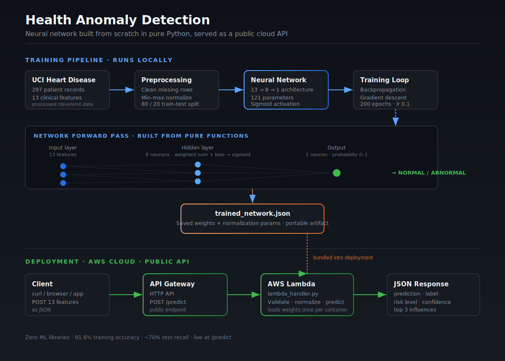

# Neural Network From Scratch — Health Anomaly Detection

A feedforward neural network built in **pure Python with zero ML libraries**, trained on real clinical data to detect heart disease, and deployed as a **public cloud API** on AWS.

No TensorFlow. No PyTorch. No scikit-learn. No NumPy. Every neuron, layer, the forward pass, backpropagation, and gradient descent — all implemented by hand using only the Python standard library.

**Live API:** `POST https://jhqy8ublrj.execute-api.us-east-1.amazonaws.com/predict`

---

## Try It

Send a patient's 13 clinical features and get back a prediction:

```bash
curl -X POST https://jhqy8ublrj.execute-api.us-east-1.amazonaws.com/predict \
  -H "Content-Type: application/json" \
  -d '{"features": [63, 1, 3, 145, 233, 1, 0, 150, 0, 2.3, 0, 0, 1]}'
```

Response:

```json
{
  "prediction": 0.004,
  "label": "NORMAL",
  "risk_level": "VERY LOW RISK",
  "confidence": 99.2,
  "top_influences": [
    {"feature": "Fasting Blood Sugar", "influence": 0.0637},
    {"feature": "Max Heart Rate", "influence": 0.0216},
    {"feature": "Thal", "influence": 0.0079}
  ]
}
```

---

## Why I Built It This Way

Every ML library is a collection of well-optimized functions. I wanted to understand what those functions actually do — so I built the machinery myself. By the time I import PyTorch in a future project, I'll know exactly what `loss.backward()` is doing because I've written backpropagation by hand.

This is the third project in a series I'm building toward ML Engineering. The first taught variables and data types. The second taught loops and conditionals through a blockchain. This one is about functions, scope, and the full lifecycle of a real ML system — from raw data to a live cloud endpoint.

---

## Architecture

<p align="center">
  
</p>


The system has two halves: a training pipeline that runs locally and produces a portable model file, and a deployment layer that serves predictions from the cloud.

```
TRAINING (local)
  UCI Data → Preprocessing → Neural Network → Training Loop → trained_network.json

DEPLOYMENT (AWS)
  Client → API Gateway (POST /predict) → Lambda → JSON Response
```

The trained weights file is bundled into the Lambda package, so the cloud serves predictions from exactly the network that was trained locally.

---

## The Network

A feedforward architecture with one hidden layer — 121 total parameters:

| Layer | Neurons | Inputs each | Parameters |
|-------|---------|-------------|------------|
| Hidden | 8 | 13 | 112 |
| Output | 1 | 8 | 9 |

Each neuron computes a weighted sum of its inputs, adds a bias, and passes the result through a sigmoid activation. Training adjusts the weights through backpropagation until predictions become accurate.

---

## Results

Trained for 200 epochs at learning rate 0.1:

| Metric | Before | After |
|--------|--------|-------|
| Accuracy | 43.3% | **91.6%** (train) |
| Loss | 0.222 | **0.070** |

Threshold analysis showed recall climbing to **81%** at a 0.3 decision threshold — catching more genuinely sick patients at the cost of more false alarms.

### Why recall matters here

In healthcare, a false negative (telling a sick patient they're healthy) is far more dangerous than a false positive. The evaluation emphasizes recall and includes threshold analysis precisely because a real deployment would prioritize catching disease over avoiding false alarms.

---

## The Data

The [UCI Heart Disease Dataset](https://archive.ics.uci.edu/dataset/45/heart+disease) (Cleveland subset) — 297 real patient records, 13 clinical features each, used in published medical research.

Preprocessing handles missing values, applies min-max normalization (saved alongside the weights so new data is scaled identically), and splits 80/20 into train and test sets so evaluation reflects generalization, not memorization.

---

## How to Run It Yourself

Requirements: Python 3.8+. No packages to install.

```bash
# 1. Download the dataset
# From https://archive.ics.uci.edu/dataset/45/heart+disease
# Place processed.cleveland.data in the project folder

# 2. Train the network
python3 neural_network.py

# This loads the data, trains for 200 epochs, evaluates,
# saves trained_network.json, and runs the prediction demo

# 3. Test the inference handler locally
python3 lambda_handler.py
```

---

## Project Structure

```
neural-network-health-detection/
│
├── neural_network.py          Training pipeline (all phases)
├── lambda_handler.py          Self-contained inference function
├── trained_network.json       Saved weights + normalization
├── processed.cleveland.data   UCI dataset
├── architecture_diagram.svg   System architecture
└── DOCUMENTATION.md           Full technical writeup
```

---

## What's Inside the Code

**`neural_network.py`** implements the complete pipeline: the four core math functions (sigmoid, its derivative, mean squared error, its derivative), the neuron and layer builders, the full forward pass, data loading and normalization, the train-test split, backpropagation, the training loop, evaluation with a confusion matrix and threshold analysis, model save/load, and a prediction interface with feature influence scoring.

**`lambda_handler.py`** is a self-contained inference function with all the network math inlined. It validates incoming requests, normalizes input on the training scale, runs the forward pass, and returns structured predictions with proper HTTP status codes. It loads the network once per container as a cold-start optimization.

---

## Python Concepts Demonstrated

Pure functions and scope, higher-order functions (passing activation functions as arguments), default parameters, mutating data structures in place vs returning new ones, nested data structures, list comprehensions, file I/O with the `csv` and `json` modules, environment-aware code, lazy loading with module-level caching, and defensive input validation throughout.

---

## Honest Limitations

This is a learning project with deliberate tradeoffs. It uses sigmoid rather than ReLU (cleaner to implement by hand). Test accuracy (~73%) trails training accuracy (91.6%), reflecting some overfitting on a small dataset. And it is a decision aid for learning, never a real diagnostic tool.

---

## Project Series

| Project | Concepts | Status |
|---------|----------|--------|
| Climate Data Analyzer | Variables, data types | Complete |
| Blockchain Simulator | Loops, conditionals, functions | Complete |
| **Neural Network From Scratch** | **Functions, scope, ML, cloud** | **Complete** |
| Coming next | NumPy & Pandas | Planned |

---

## References

- LeCun, Bengio, Hinton — *Deep Learning*, Nature 2015
- Detrano et al. — UCI Heart Disease Dataset, 1989
- AWS Lambda Developer Guide

---

## License

MIT
